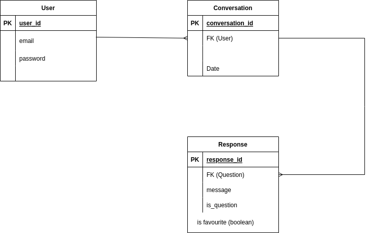
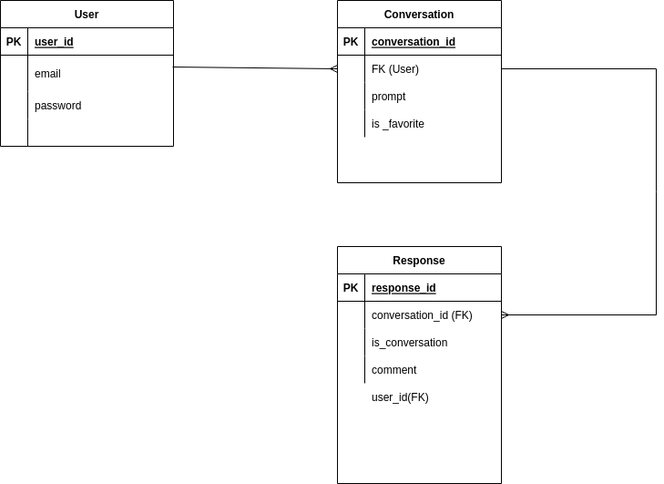

# AI website prompt saver

My website will be a simple ask AI website. It will allow the user to ask the CHATGPT(API) questions and receive answers, then it will allow the user to save certain prompts to be seen by the user at a later time if needed, a stretch goal I would also hope to have is letting users share their prompts if they wanted to be seen by other users.

## Choice of API: ChatGPT.

Installation: `npm i`

Website link: [https://gptsaves-deployment-project2.herokuapp.com/users/conversations]

The approach I took was incorrect at first, I tried to implement the API while also building the website. I learned from this mistake and had to rebuild the website starting from the foundation and working with dummy data then implementing the A.I. I worked on it piece by piece being careful about tackling bugs as they came up. 

Dependencies used: `
axios
bcrypt
bootstrap
cookie-parser
crypto-js
dotenv
ejs
express
method-override
path
pg
sequelize
sequelize-cli
`

| HTTP Verb | URL                              | CRUD   | Description                                                      | View               |
| --------- | -------------------------------- | ------ | ---------------------------------------------------------------- | ------------------ |
| GET       | /                                | Read   | Home view                                                        | Home               |
| GET       | /conversations                   | Read   | List all conversations                                           | Conversations      |
| GET       | /conversations/:id               | Read   | Retrieve a specific conversation and its responses               | Conversation       |
| POST      | /conversations                   | Create | Create a new conversation                                        | Conversations      |
| POST      | /conversations/:id               | Create | Add a new response to a conversation                             | Conversation       |
| GET       | /users/favorites                 | Read   | List all user's favorite conversations with comments              | Favorites          |
| PUT       | /users/favorites/:id             | Update | Update a comment under a favorite                                 | Favorites          |
| POST      | /users/favorites                 | Create | Add a new favorite                                               | Favorites          |
| DELETE    | /users/favorites/:id             | Delete | Delete a favorite                                                | Favorites          |
| GET       | /users/conversations             | Read   | List all user's conversations                                     | User Conversations |
| GET       | /users/conversations/:id         | Read   | Retrieve a specific conversation and its responses for a user     | User Conversation  |
| POST      | /users/conversations             | Create | Create a new conversation for a user                              | User Conversations |
| PUT       | /users/conversations/:id         | Update | Update a conversation for a user                                  | User Conversation  |
| POST      | /users/conversations/:id/comments| Create | Add a new comment to a conversation for a user                    | User Conversation  |
| POST      | /users/conversations/:id/favorite| Create | Mark a conversation as favorite for a user                        | User Conversation  |
| PUT       | /users/conversations/:id/favorite| Update | Update a conversation's favorite status for a user                | User Conversation  |
| DELETE    | /users/conversations/:id/favorite| Delete | Unmark a conversation as favorite for a user                      | User Conversation  |
| DELETE    | /users/conversations/:id         | Delete | Delete a conversation for a user                                  | User Conversations |

## User Stories:
Have a question that will be relevant later, ask the AI the question and favourite it.
Be able to go back to see the answer to the question and your thoughts on it.
Be able to see other peoples questions and see what their thoughts on the answers were.

## MVP goals:
Be able to ask chatgpt a question and receive a relevant answer.
Be able to add the question prompt and answer to a favourites page, as well as a comment associated with it.
Light and dark theme.

## Stretch goals:
Be able to see other users public questions and comments on said questions.
Be able to like and comment on their questions/answers.

